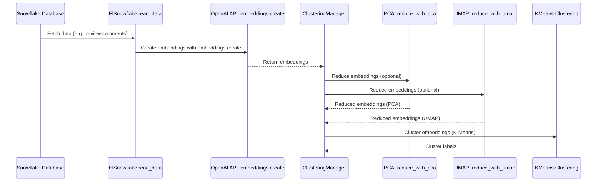
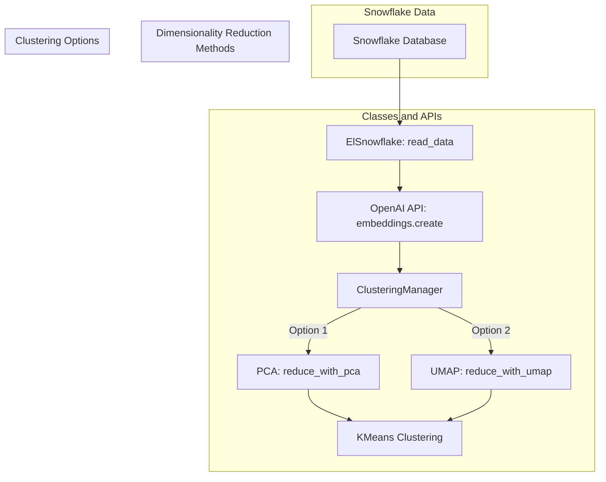

# Embedding Labels - A Cluster Exploration for Auto-Classification

A exploration of the clustering potential of high-dimensional embedding vectors.
The goal goal to evaluate the utility of clustering to discover patterns or categories in data, such as code review comments. These cluster names will become labels in a training data set in a Snowflake table. By labeling the clusters, we can use these labeled data points to train a model that will automatically classify new comments based on their characteristics.

### Business uses:

1. a potential for a higher quality : cost ratio for tasks requiring clustering.
2. allows for automation for labeling a data set prior to training a model.

## Embedding models

Which embedding model you use has a lot to do with the type of content you are vectorizing. Price should be considered also.
The dimensions value must match your Pinecone settings also.

[Learn about embeddings](#)

| Model                  | Dimensions | Pricing            | Pricing with Batch API |
| ---------------------- | ---------- | ------------------ | ---------------------- |
| text-embedding-3-small | 1,536      | $0.020 / 1M tokens | $0.010 / 1M tokens     |
| text-embedding-3-large | 3,072      | $0.130 / 1M tokens | $0.065 / 1M tokens     |
| ada v2                 | 1,536      | $0.100 / 1M tokens | $0.050 / 1M tokens     |

# Install

```bash
python3 -m venv venv
source venv/bin/activate
pip3 install -r requirements.txt
vi .env
```

# Run the program

Make sure you set up your .env file before running.

# Settings - the .env file should have

```
# Snowflake Settings
SNOWFLAKE_USER=
SNOWFLAKE_PASSWORD=
SNOWFLAKE_ACCOUNT=
SNOWFLAKE_WAREHOUSE=
SNOWFLAKE_DB=
SNOWFLAKE_SCHEMA=

# Pinecone and OpenAI Shared Settings (this needs to match your selected model)
EMBEDDING_DIMENSIONS=1536

# Pinecone Settings
PINECONE_API_KEY=
PINECONE_METRIC=cosine
PINECONE_CLOUD=aws
PINECONE_REGION=us-east-1
PINECONE_PROJECT_NAME=
# The full index name is built from the base, the embedding model, and dimensions
PINECONE_BASE_INDEX_NAME=el
OPENAI_API_KEY=
OPENAI_EMBEDDING_MODEL=text-embedding-ada-002
OPENAI_COMPLETIONS_MODEL=gpt-4o-mini
```

## Background: Using OpenAI Embeddings for Clustering Review Comments

This project uses OpenAI embeddings to generate semantic vectors from review comments. Embeddings capture the meaning of the comments in a fixed-length vector, allowing us to understand the similarity between comments beyond mere word matching.

### Embedding Model Utility:

1. **Semantic Understanding**: Embeddings encode the meaning of comments, so reviews with similar themes or ideas can be grouped together, even if they use different words.
2. **Dimensionality Reduction**: By converting text into numerical vectors (e.g., 512 dimensions), embeddings enable clustering and analysis using mathematical models.

3. **Distance Metrics**: Once the embeddings are generated, we can calculate the distance between them using metrics like cosine similarity or Euclidean distance, which is the basis for clustering.

## Dimensionality Reduction: Why and How It's Applied in This Project

### Why Dimensionality Reduction is Necessary

As embeddings, like those generated by OpenAI models, can be high-dimensional (e.g., 1536 or 3072 dimensions), using them directly for tasks like clustering can pose challenges:

1. **Computational Efficiency**: High-dimensional data increases the computational complexity of algorithms, slowing down clustering and analysis. Reducing the dimensionality improves processing speed and memory usage.
2. **The Curse of Dimensionality**: In very high-dimensional spaces, data points tend to become equidistant from one another, making it harder for clustering algorithms to find meaningful groups. Reducing the dimensionality focuses on the most important features, making clusters more distinct and interpretable.

3. **Storage and Retrieval Costs**: Storing large, high-dimensional embeddings in vector databases (like Pinecone) increases storage costs. Reducing dimensions can significantly reduce the storage and retrieval costs without losing key semantic information.

### Clustering Algorithms _not_ chosen

#### HDBSCAN (Hierarchical Density-Based)

HDBSCAN was considered for clustering code review comments, but it did not provide distinct and well-separated clusters. The results showed significant overlap between points, making it difficult to assign meaningful categories or labels. Although some outliers were identified, the dense clustering lacked clear boundaries, reducing its utility for labeling code review comments effectively.

#### DBSCAN (Density-Based)

DBSCAN, a **density-based clustering** algorithm, was tested but did not yield useful results for categorizing code review comments. The majority of the data points were assigned to a single, dense cluster, with only a few outliers identified. The lack of clear cluster separation and meaningful groupings made it difficult to label the clusters in a way that would be useful for auto-classification. Due to these limitations, we decided to explore alternative clustering algorithms.

#### Agglomerative Clustering

**Agglomerative** refers to the process of **gradually combining smaller elements into larger ones**, often through a hierarchical approach. In the context of clustering, **Agglomerative Clustering** is a **bottom-up hierarchical clustering** method.

- **Agglomerative Clustering** starts with each data point as its **own individual cluster**.
- Gradually, it **merges pairs of clusters** based on some similarity measure (like distance) until all points are merged into a single large cluster or until a stopping criterion (like the number of clusters) is reached.
- **Agglomerative** is a **bottom-up approach**: small clusters are merged into larger ones.
- The opposite of agglomerative is **divisive**, which is a **top-down** approach: starting with one large cluster and splitting it into smaller clusters.

In summary, **Agglomerative Clustering** refers to a method that builds clusters by merging smaller groups into larger ones based on proximity or similarity.

Agglomerative Clustering was tested, and while it showed slightly better separation than other methods, it still failed to provide distinct, well-separated clusters for the code review comments. The majority of the data points were tightly packed into a single large cluster, with only a few isolated groups. This lack of clear cluster boundaries made it difficult to assign meaningful labels, limiting its utility for categorizing and auto-classifying the comments.

### Reducing Dimensions at the Source (OpenAI Embeddings API) - Doesn't work

#### Why We Can't Reduce Embedding Dimensions at the Source

OpenAI’s embedding models, such as `text-embedding-ada-002` and `text-embedding-3-large`, generate embeddings with a **fixed number of dimensions** (e.g., 1536 or 3072 dimensions, depending on the model). These dimensionalities are determined by the architecture of the models and cannot be dynamically reduced during the embedding generation process. There is no parameter available in the OpenAI API to request a lower-dimensional embedding directly.

As a result, while it might seem appealing to reduce the dimensionality at the source to save costs and computation, this is not possible with current OpenAI models. Instead, after generating the high-dimensional embeddings, you must apply dimensionality reduction techniques like **PCA** or **UMAP** to compress the embeddings into fewer dimensions (e.g., 256 or 512) while retaining their key semantic properties. This post-processing approach ensures that embeddings can be optimized for performance, storage, and retrieval without losing critical information.

### Primary Dimensionality Reduction Methods Used

When dimensionality needs to be reduced after generation, this project uses the following methods to reduce the size of embeddings:

1. **Principal Component Analysis (PCA)**:

   - **How It Works**: PCA is a linear dimensionality reduction technique that transforms the data into a set of new axes (principal components). These components are ordered by the amount of variance they capture in the data, allowing us to keep only the most important ones.
   - **When It's Used**: PCA is used to reduce embeddings from higher dimensions (e.g., 1536) down to a more manageable size (e.g., 50 dimensions), preserving key variance in the data while reducing noise.

2. **UMAP (Uniform Manifold Approximation and Projection)**:
   - **How It Works**: UMAP is a nonlinear technique that reduces dimensionality while preserving both local and global structures in the data. It is particularly effective for retaining semantic meaning, such as sentiment or topic relationships, even in reduced dimensions.
   - **When It's Used**: UMAP is used to reduce the dimensionality of embeddings before clustering to preserve the relationships between similar comments, especially when semantic meaning is important.

### How We Apply Dimensionality Reduction

- **Reducing for Clustering**: Embeddings are first reduced to around **50 dimensions** using either PCA or UMAP before clustering. This strikes a balance between retaining semantic meaning and improving the computational efficiency of clustering algorithms like K-Means.

- **Reducing for Visualization**: For visualizing the clusters, we further reduce the embeddings to **2 dimensions** using PCA or UMAP. This allows us to create 2D scatter plots to visualize how comments are grouped after clustering.

By using dimensionality reduction techniques, we maintain the core semantic properties of review comments while optimizing for both performance and interpretability.

# Clusters discovered with K-Means

To identify which **"cluster number"** corresponds to each color in your plot, you can use the **K-Means labels** that were generated during the clustering process. The labels map each point (or comment) to a specific cluster number, which you can then match to the colors in the plot.

### Steps to Identify Cluster Numbers:

1. **Retrieve the Labels**: When K-Means clustering is performed, the resulting labels are stored in the `kmeans_labels` array. Each label represents the **cluster number** that the corresponding comment belongs to.
2. **Map the Labels to Comments**: You can print out the cluster number and the associated review comments (the text snippets) to get a sense of what each cluster represents.

3. **Assign Cluster Names**: Based on the common themes in the comments of each cluster, you can assign a **human-readable name** to each cluster.

This **Summary of Refined Clusters** looks well-organized and accurately reflects the information value of each cluster. Here's a version you can directly use in your README or documentation:

---

### Summary of Refined Clusters:

1. **Cluster 0**: **Medium value comments**. Positive Feedback and simple suggestions.
2. **Cluster 1**: **Medium value comments**. Code Review and Preferences.
3. **Cluster 2**: **High value comments**. Refactoring and Technical Suggestions.
4. **Cluster 3**: **Low value comments**. Completion or Task Finalization.
5. **Cluster 4**: **High value comments**. Minor Code Suggestions.
6. **Cluster 5**: **High value comments**. Technical Clarifications and Code Safety.
7. **Cluster 6**: **High value comments**. UI/UX and Design Feedback.

# Diagrams

### Sequence



### System


