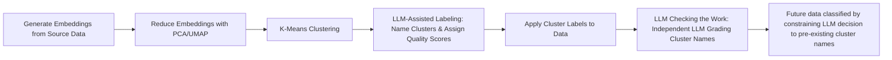
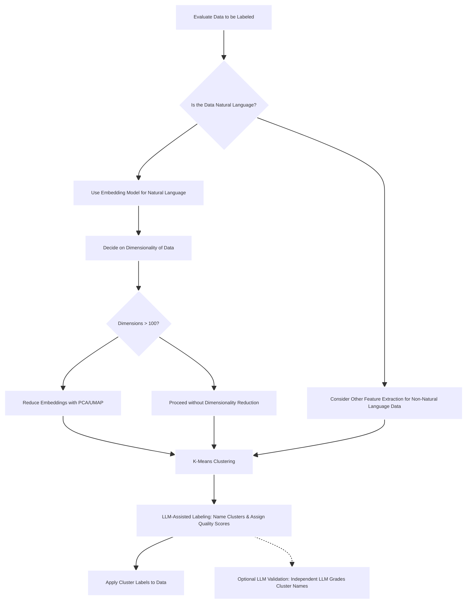

# Embedding Labels - A Generic Hybrid Approach for Model Training Using Clustering and LLM Assistance

**Background: Overcoming the Human Labeling Bottleneck**

One of the biggest challenges in data categorization tasks is the manual effort required for human labeling. Whether it's classifying code review comments or organizing feedback, manually labeling thousands of entries is time-consuming, prone to inconsistencies, and demands significant domain expertise.

This project leverages high-dimensional embedding vectors to automatically cluster similar comments and utilizes a Large Language Model (LLM) to assign a name and quality score to each cluster. This approach enables teams to rapidly generate organized datasets without manual effort, streamlining the process of building custom classification systems.



### Key Benefits:

1. **Automated Labeling**: Automatically assign meaningful labels to large datasets, saving teams from manual, error-prone work.
2. **Faster Model Training**: Generate training datasets with labeled data faster, allowing machine learning models to be built more efficiently.
3. **Improved Consistency**: Leverage the LLM to provide consistent labels across similar comments, reducing human bias and variance.

---

## Business Uses:

1. **Higher quality-to-cost ratio** for tasks requiring clustering.
2. **Automated labeling** of a dataset before training a model, reducing manual effort.

---

## Embedding Models

| Model                  | Dimensions | Pricing            | Pricing with Batch API |
| ---------------------- | ---------- | ------------------ | ---------------------- |
| text-embedding-3-small | 1,536      | $0.020 / 1M tokens | $0.010 / 1M tokens     |
| text-embedding-3-large | 3,072      | $0.130 / 1M tokens | $0.065 / 1M tokens     |
| ada v2                 | 1,536      | $0.100 / 1M tokens | $0.050 / 1M tokens     |

---

## Background: Using OpenAI Embeddings for Clustering Code Review Comments

This project uses OpenAI embeddings to generate **semantic vectors** from code review comments. Embeddings capture the meaning of the comments in a **fixed-length vector**, allowing us to understand similarity beyond mere word matching.

---

## Dimensionality Reduction: Current Approach

### Why Dimensionality Reduction is Necessary

High-dimensional embeddings (like those with 1536 dimensions) can pose challenges due to the **curse of dimensionality** and **computational inefficiency**.

1. **Clustering in 100 Dimensions**: Before clustering, embeddings are reduced from 1536 to 100 dimensions. This preserves enough variance to allow effective clustering while avoiding performance issues.
2. **Visualization in 2D**: For visualization purposes, embeddings are further reduced to 2 dimensions using **UMAP** or **PCA**.

---

## Clustering Method: K-Means with LLM-Based Naming

### Using K-Means Clustering:

- K-Means clustering is performed in the **100-dimensional space** after reducing the original 1536 dimensions.
- The **LLM** (Language Learning Model) then analyzes each cluster and suggests a **cluster name** and a **quality score** for the cluster (on a scale from 1 to 5).

### LLM for Cluster Naming and Quality Scoring:

1. **Naming**: The LLM provides a **name** for each cluster based on common themes or subjects in the comments.
2. **Quality Score**: Each cluster is also assigned a **quality score** based on the usefulness or importance of the comments. The scale is 1-5, where **1** represents general or low-value feedback, and **5** represents specific, actionable feedback.

---

## Storing Cluster Classifications in Snowflake

Once the clusters are named and scored, the results are stored in Snowflake for future model training. We use the **`pr_review_comments_training`** table, which has the following structure:

```sql
CREATE TABLE IF NOT EXISTS "pr_review_comments_training" (
    "comment_id" BIGINT PRIMARY KEY,
    "repo_name" VARCHAR(256),
    "pr_number" VARCHAR(64),
    "user_login" VARCHAR(256),
    "body" TEXT,
    "created_at" TIMESTAMP_NTZ,
    "label" TEXT, -- this is our classification column
    "quality_score" INT -- since we're classifying, why not evaluate the overall quality of the cluster too?
);
```

When storing classifications, both the **cluster name** (label) and the **comment body** are stored, which allows for human verification if needed.

---

## Summarizing Clusters

After clustering and LLM-based labeling, the program provides a summary of how many reviews are assigned to each cluster. This is helpful for evaluating the size and distribution of the clusters.

---

### Example of Cluster Summary:

```
Cluster Review Summary:
Design and Functionality Feedback            60
Code Refactoring and Optimization Suggestions 50
Navigation and Code Refactoring Suggestions   40
Minor Feedback and Code Style Improvements    35
Collaborative Feedback and Refinements        25
Positive Acknowledgments                      20
Task Completion                               20
```

---

## Diagrams

### Sequence


### Implementing your own system

#### Know your data

Evaluate Before Clustering:

1. Data Type: Continuous, Categorical, or Mixed?
2. Cluster Shape: Spherical or Irregular?
3. Cluster Count: Known or Unknown?
4. Noise: Is there noise/outliers?
5. Dimensionality: Is data high-dimensional >100?
6. Scalability: Dataset Size?

#### Other decisions to make



# Install

```bash
python3 -m venv venv
source venv/bin/activate
pip3 install -r requirements.txt
vi .env
```

## Run the program

Make sure you set up your .env file before running.

```bash
python3 el_cluster.py
```

## Environment

# Snowflake Settings

```
SNOWFLAKE_USER=
SNOWFLAKE_ROLE=
SNOWFLAKE_PASSWORD=
SNOWFLAKE_ACCOUNT=
SNOWFLAKE_WAREHOUSE=
SNOWFLAKE_DB=
SNOWFLAKE_SCHEMA=

# Pinecone and OpenAI Shared Settings

EMBEDDING_DIMENSIONS=1536

OPENAI_API_KEY=
OPENAI_EMBEDDING_MODEL=text-embedding-3-small
OPENAI_USER=
OPENAI_COMPLETIONS_MODEL=gpt-4o-mini
```
